<!-- footer: <small><i style="font-size: 8pt;font-weight:500;color:black">AI in Computational Arts, Music, and Games </small></i> 
 
 -->
<!-- _color: black -->

# Machine Learning for Arts and Music

---

# Audio-visual Excerpt Production Using Comfy UI

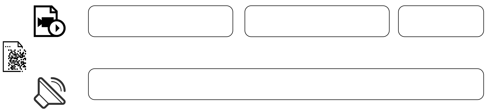

Goal: Production of a 1-minute audio-visual except where video and sound is generated using generative AI running on comfyUI

---

# Three Steps for Production 

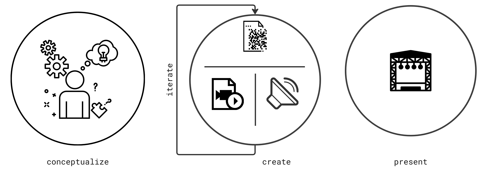

---
<!-- _class: no_border -->

## Step 1: Conceptualize

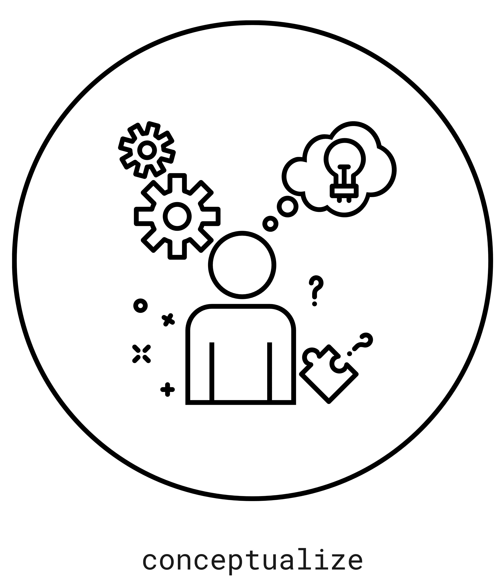

How to come-up with a concept using Generative AI? 

---

## Ideation using LLMs

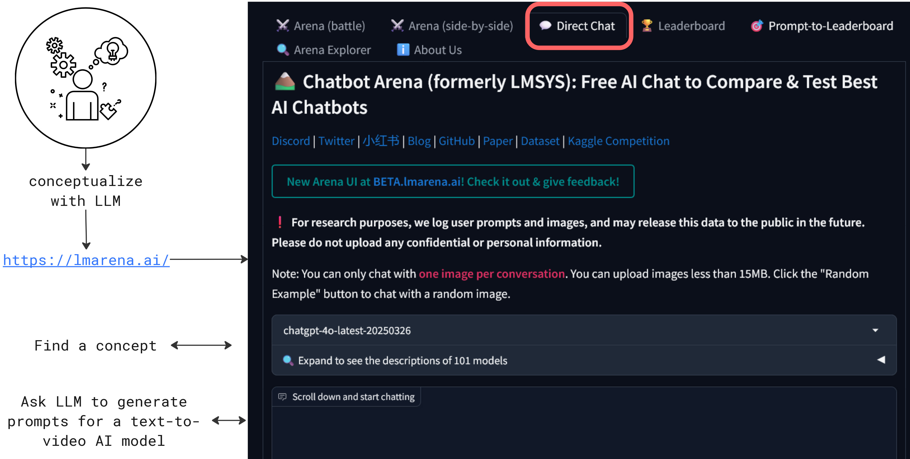

---

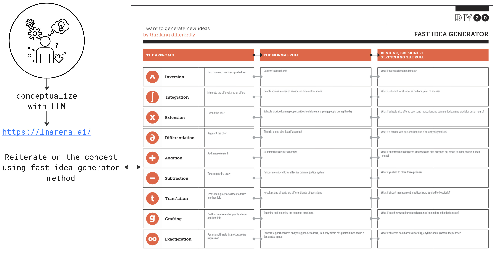

---

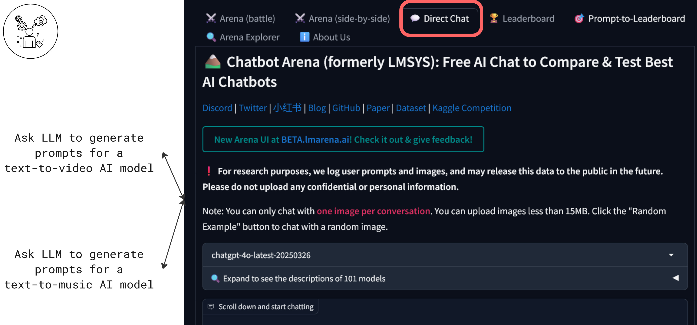

---

## Step 2: Create and Iterate

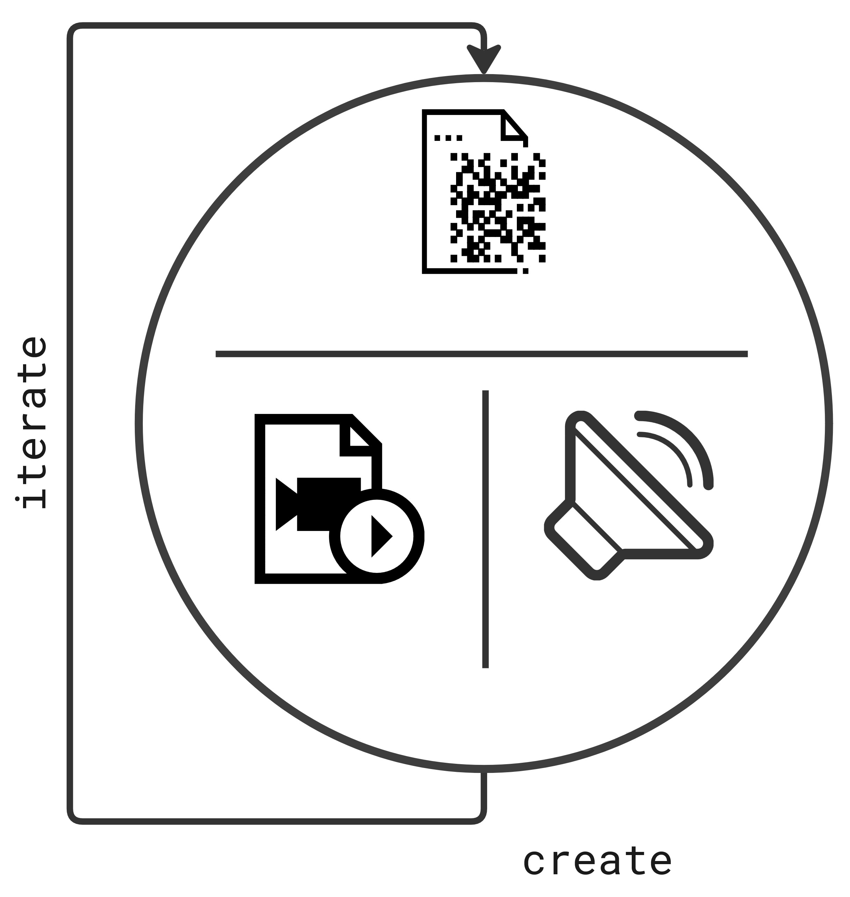

---

### Finding GenAI models on ComfyUI

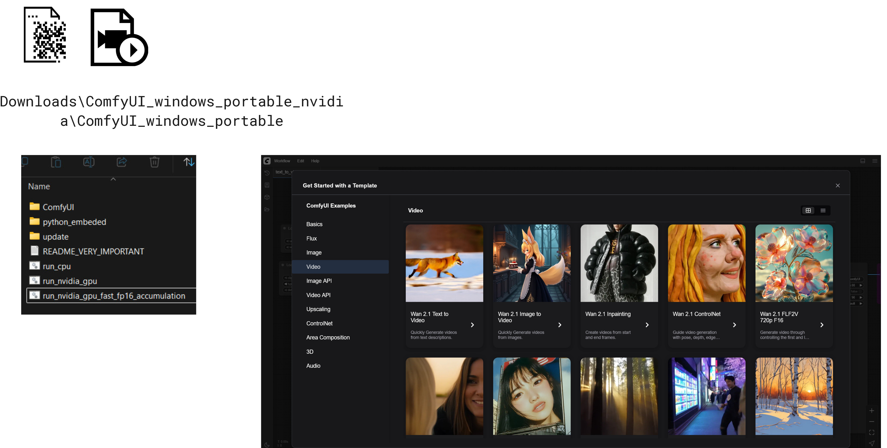

---

### Video Generation using WAN 2.1 text-to-video

Task: Generate 3-5 videos 

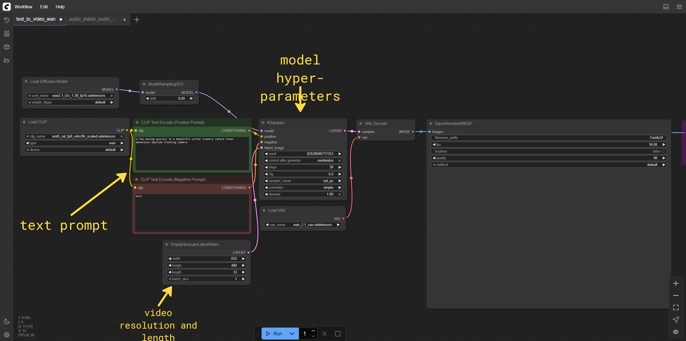

---

### Sound Generation using Stable Audio

Task: Generate 5-7 sounds 

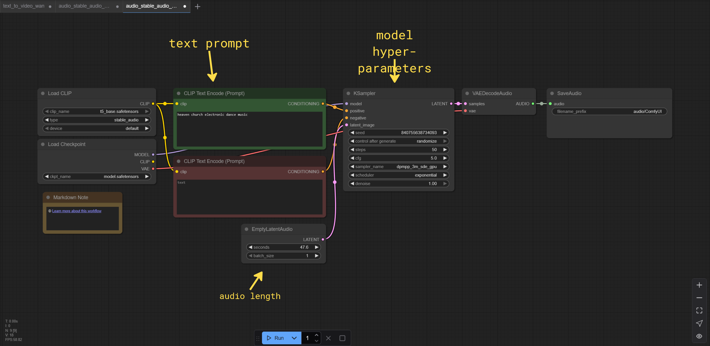

---

### Bringing All together using Shotcut

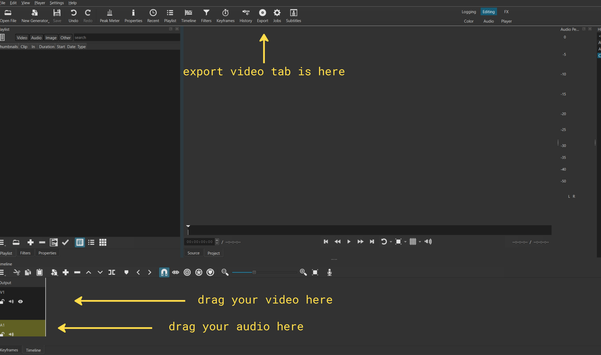

--- 

# Using Jupyter Notebook for Content Generation

TBD

---