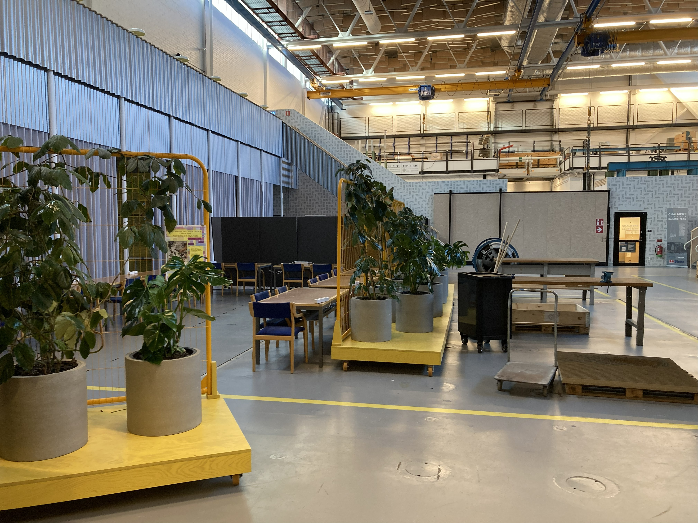

<!-- footer: <small><i style="font-size: 8pt;font-weight:500;color:black">AI in Computational Arts, Music, and Games </small></i> 
 
 -->
<!-- _color: black -->

# Machine Learning for Arts and Music

---

# What is TRA 385?

This is a list:

- item 1
- item 2
- item 3

---

# This is a table 

| Activities  |  |  | | |
|:---|---|---|---|---|
| **Lectures** | Introduction to Art and Technology | Introduction to AI and ML | Creativity, Group work, and Tools for Innovation |
| **Tutorials** | Creative Coding with Sound (PureData) | Multimedia Design with TouchDesigner | Deep Learning for Multimedia | Interactive ML with Physical Computing |
| **Project** |Project Proposal| Design Iterations | Final Prototype | Reflections |

---
<!-- _class: no_border -->

# This is the same table without borders

| Activities  |  |  | | |
|:---|---|---|---|---|
| **Lectures** | Introduction to Art and Technology | Introduction to AI and ML | Creativity, Group work, and Tools for Innovation |
| **Tutorials** | Creative Coding with Sound (PureData) | Multimedia Design with TouchDesigner | Deep Learning for Multimedia | Interactive ML with Physical Computing |
| **Project** |Project Proposal| Design Iterations | Final Prototype | Reflections |

See how *Activities* are not bold now. That is because th class is updated in section.no_border class in my_theme.css  

---
<!-- _class: columns -->

## Two column slide

Originally solution from <https://github.com/orgs/marp-team/discussions/192#discussioncomment-1516155>

## Can't believe this works. YOLO

If you are brave for more sections, here is an online tool for css grids: https://grid.layoutit.com/

---

# Image on the left

---

# AND Image on the right

---

# Local videos are possible 

<video controls src="pb-ars.mp4" width="800"></video>

---

# Online videos as well 

<iframe width="560" height="315" src="https://www.youtube.com/embed/nx2Nj3I7NyU?si=5D-PemuLUUt3qepd&amp;controls=0" title="YouTube video player" frameborder="0" allow="accelerometer; autoplay; clipboard-write; encrypted-media; gyroscope; picture-in-picture; web-share" referrerpolicy="strict-origin-when-cross-origin" allowfullscreen></iframe>

This should work only when the presentation is hosted online. Youtube does not allow local hosts apparently.

---

# Fancy image options

` ` command works for creating empty spaces [2].

 

<small>[1] this is a smaller text. Great for citations. 

[2] https://marpit.marp.app/image-syntax
</small>

---

# Inline HTML commands works 

 Text can be changed for example 

---

# <!--fit-->BIG TEXT

---

# How to export to github pages? 

- Copy this template
- Setup github pages to deploy from a branch. Choose main branch. 
  - There is no workflow, so that what you see local is what you get online as a static html. 
- Once you are done with your presentation, render it to html locally.
  - On VS Code, you can just use the marp icon on the top right. 
  - Make sure the file saved is index.html.  
- Commit changes to the remote repo.
- Done! Page should be online at [user-name].github.io/[repo-name] after a few minutes.

---

# Latex Math friendly

## Inline math

Render inline math such as $ax^2+bc+c$ [1].

## Math block

$$ I_{xx}=\int\int_Ry^2f(x,y)\cdot{}dydx $$

$$
f(x) =
  \int_{-\infty}^\infty
  \hat f(\xi)\,e^{2 \pi i \xi x}
  \,d\xi
$$

 

<small>[1] More details: https://github.com/marp-team/marp/blob/main/website/docs/guide/math-typesetting.md </small>

---

# Videos need to be formatted for web

You can use ffmpeg locally for this.

`ffmpeg -i input.mp4 -c:v libvpx-vp9 -crf 30 -b:v 0 output.webm` 

note: tested and works

<small>[1] Source: https://jshakespeare.com/encoding-browser-friendly-video-files-with-ffmpeg/ </small>

---

# FFMPEG continued: another solution

fast and efficient h264 for the web :

`ffmpeg -i in.mp4 -c:v libx264 -profile:v high -preset slow -crf 24 -c:a aac -b:a 96k -movflags +faststart out.mp4`

More efficient but slower with VP9/webm

`ffmpeg -i in.mp4 -c:v libvpx-vp9 -crf 33 -b:v 0 -c:a libopus -vbr on -b:a 64k out.webm`

<small>[1] https://www.reddit.com/r/ffmpeg/comments/8kxjhz/encoding_video_for_my_website/ </small>

---

# FFMPEG continued

I haven't tried this solution yet.

WebM:

`ffmpeg -i my-original-video.wmv -f webm -vcodec libvpx-vp9 -vb 1024k my-new-video.webm`

MP4: 

`ffmpeg -i my-original-video.wmv -vcodec libx264 -f mp4 -vb 1024k -preset slow my-new-video.mp4`

<small>[1] Source: https://jshakespeare.com/encoding-browser-friendly-video-files-with-ffmpeg/ </small>